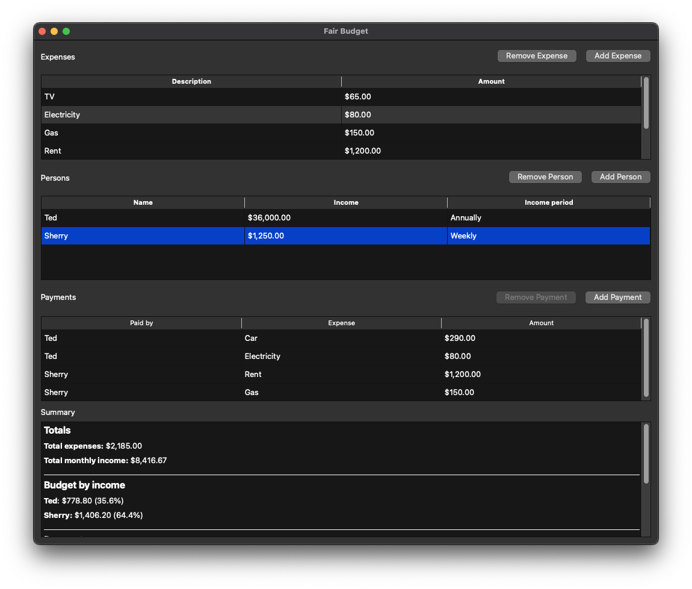

# Fairbudget

Fairbudget is a desktop GUI app built on the [Qt 6 C++ framework](https://doc.qt.io/qt-6.5/). It provides a way for households to easily tally up their expenses and income to determine who owes what to whom. The amount each person owes is proportional to their income -- that's what makes this budgeting app *fair*.

## Features
- Track household expenses
- Calculate share of expenses owed proportional to income
- Input income using various periods (weekly, monthly, annually, etc.)
- Almost as good as a spreadsheet!

## Installation
Currently not released as a pre-built executable. If you want to run it, you'll have to build it.

## Build

### Requirements
This project requires CMake 3.5 or later and compiles using C++17. You must also make sure to [install Qt 6](https://doc.qt.io/qt-6/get-and-install-qt.html) on your system. The GoogleTest C++ framework is also used for tests though that will be downloaded automatically by CMake.

### Build
- Create a *build* directory outside of the source code root
- `cd build`
- `cmake ../Fairbudget`
- `cmake --build .`

### Background
This project is largely a vehicle for learning the Qt 6 C++ framework. Because of that, this isn't the cleanest or most well documented code. It's maybe a step above prototype quality -- but not by much :)
